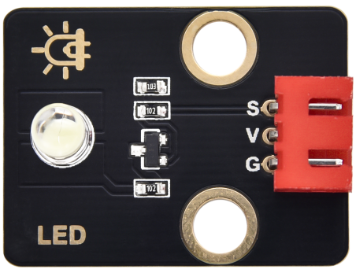

## 1. 介绍

Keyes 2021新款DIY电子积木白色LED模块是一款专为电子爱好者和教育工作者设计的高品质模块。该模块采用了环保材料，符合现代可持续发展理念，确保安全和耐用性。通过易于连接的设计，用户可以快速构建各种电子项目，适用于教育、实验和DIY创意活动。白色LED能够提供明亮的照明效果，使其在多种应用场景中表现出色。

## 2. 特点

- **环保材料**：该LED模块采用黑色环保材料制作，符合安全标准，适合各种应用场景。
- **高亮度**：使用F5-白发白LED，提供高亮度的白光显示，适合作为指示灯或照明灯。
- **防反插接口**：模块上配备的2.54mm红色防反插端子，确保用户在连接时不会接错线，提高了使用安全性。
- **兼容性**：模块可以与多种单片机控制板（如Arduino、树莓派等）兼容，方便用户将其用于不同的项目中。
- **易于安装**：配备3pin白色防反插连接线，简化了接线过程，适合初学者和儿童使用。
- **固定孔位**：两个直径为3mm的乐高兼容孔位，方便将模块固定在乐高砖或其他设备上，增强模块的使用灵活性。

## 3. 规格参数

- **型号**: KE4001
- **LED类型**: F5-白发白LED（白光）
- **导线长度**: 200mm
- **工作电压**: DC 3.3V - 5V
- **接口类型**: 间距为2.54mm的3pin防反接口
- **定位孔大小**: 直径为3mm
- **控制信号**: 数字信号（高低电平）
- **尺寸**: 32mm x 23.5mm x 12mm
- **功耗**: 约20mA（在5V工作时）

## 4. 工作原理

该LED模块基于数字信号控制，模块的工作原理可以概述如下：

- **电源连接**：模块通过GND和VCC端口连接到电源，支持3.3V至5V的工作电压范围。可靠的电源连接确保LED能够正常工作。

- **信号控制**：模块的信号端（S）接收来自控制器的输入信号。该信号确定LED的开启和关闭状态。当信号为高电平时，LED亮起；当信号为低电平时，LED熄灭。

- **PWM调光功能**：此模块支持PWM（脉宽调制）技术，通过调节信号的占空比，用户可以实现不同程度的亮度控制。例如，可以使LED逐渐变亮或变暗，从而创建如呼吸灯等效果。

- **连接配置**：模块设计便于快速组装和拆卸，红色防反插端子和配套导线确保用户能够安全、快速地完成连接，减少因接错引起的损坏风险。

## 5. 脚位描述

模块的连接引脚定义如下：

| 引脚名称 | 描述                            |
|----------|---------------------------------|
| VCC      | 电源正极连接，支持3.3V至5V输入 |
| GND      | 电源负极连接                    |
| S        | 信号输入端，用于控制LED的开关状态 |

- **VCC**：该引脚连接到电源的正极，提供LED模块所需的电压。在使用时，确保电源电压在3.3V到5V之间，以避免损坏模块。
  
- **GND**：该引脚连接到电源的负极（地），确保模块正常工作，建立稳定的电源参考。

- **S（信号端）**：此引脚接收来自控制器的信号输入。当信号为高电平时，LED点亮；当信号为低电平时，LED熄灭。用户可以在编程中根据需求控制该引脚的状态。

## 6. 应用场景

Keyes 2021新款DIY电子积木白色LED模块广泛应用于各种场合，包括但不限于：

- **教育**：用于电子课程和实践活动，帮助学生理解LED工作原理和电路基础。
- **家居照明**：作为简单的指示灯或辅助照明，提供灵活的安装选项。
- **DIY项目**：适用于各种创意项目，如创作自制灯具、互动作品或电子玩具等。
- **实验**：在电子实验中作为亮度测试或状态指示灯，方便观察项目运行状态。

