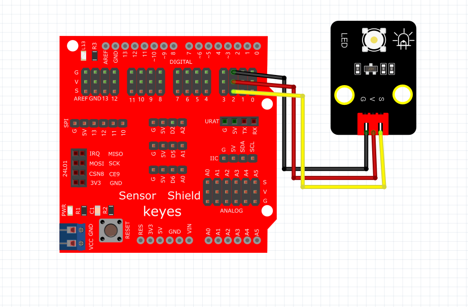

# Arduino 开发环境

## 1. Arduino编程软件介绍

**Arduino**是一种开放源代码电子原型平台，结合了可编程的微控制器和易于使用的硬件和软件。Arduino IDE提供了一个简洁的编程环境，使得开发者能够轻松地编写代码并上传到Arduino板上，实现各种电子项目。

Arduino编程使用一种基于C/C++的语言，适合初学者和专业人士。其广泛应用于教育、创客项目、物联网设备和电子艺术等领域，能够快速实现从简单到复杂的电子控制和传感器应用。

---

## 2. 连接图



## 3. 测试代码

```cpp
int led = 2; // 定义数字口2

void setup() {
    pinMode(led, OUTPUT); // 设置led为输出
}

void loop() {
    digitalWrite(led, HIGH); // 开启led
    delay(2000); // 延迟2S
    digitalWrite(led, LOW); // 关闭led
    delay(2000); // 延迟2S
}
```

## 4. 测试结果

烧录好测试代码，按照接线图连接好线；上电后，LED模块上的LED闪烁，亮2秒，灭2秒，循环交替。

## 5. 加强训练（呼吸灯）

这一部分涉及PWM（脉宽调制）控制方式。PWM的基本原理是通过控制逆变电路开关器件的通断，输出一系列幅值相等但宽度不一致的脉冲。通过这些脉冲，可以在输出中形成平滑的电压波形，并且能够有效调节输出电压和频率。

在这一示例中，我们将LED从数字口2换到数字口3，数字口3前面的波浪线“~”表示该引脚支持PWM。

**代码示例：**

```cpp
int ledPin = 3; // 定义LED接口为PWM数字口3

void setup() {
    pinMode(ledPin, OUTPUT); // 初始化led引脚为输出模式
}

void loop() {
    for (int value = 0; value < 255; value += 1) {
        analogWrite(ledPin, value); // LED亮度增加
        delay(10); // 延迟10ms
    }
    for (int value = 255; value > 0; value -= 1) {
        analogWrite(ledPin, value); // LED亮度减少
        delay(10); // 延迟10ms
    }
}
```

**结果：**上传代码后，LED会由暗变亮然后再由亮变到暗，这样我们便得到了一个呼吸灯。（如果没有实现这个功能，先检查LED的S端是否接在第3脚）

